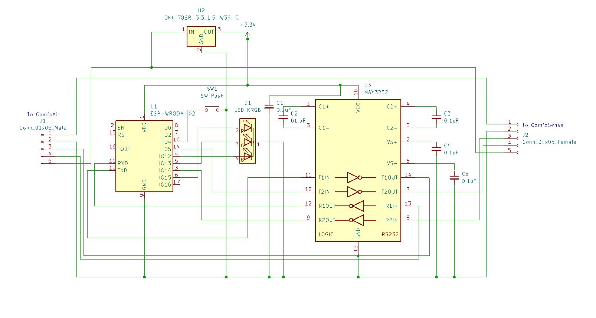
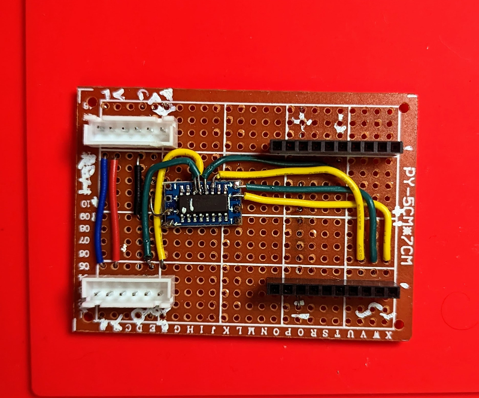
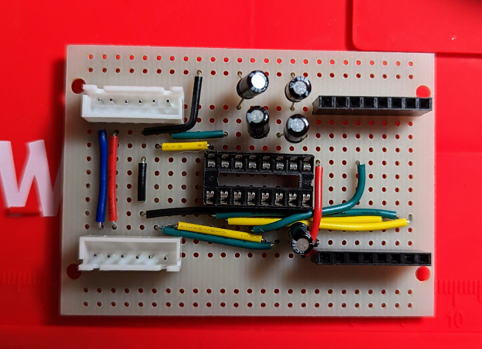
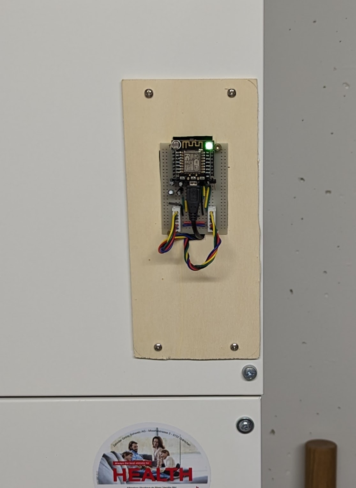

# ComfoAir
This is a clone of https://github.com/wichers/esphome-comfoair repo with a few modifications:

1. It contains the fixes to the Climate control modifciations made in https://github.com/nilsbebelaar/esphome-comfoair fork. 
  - Set prefered temp.
  - Proper checksum computation.
1. More cannonical C++ style of the code (e.g. no this-> all over the place). 
1. Supports connecting a ComfoSense remote to a second UART and proxies commands back and forth.
1. Support for status leds
1. Support for filter reset command
1. Support for a phisical button on the device

## Building the thing

### BOM:

1. ESP8266 serial WIFI Witty cloud Development Board ESP-12F module MINI nodemcu [buy here](https://www.aliexpress.com/item/32832264128.html)
2. ~~Mini RS232 MAX3232 Levels to TTL level converter board serial converter board  [buy here](https://www.aliexpress.com/item/32261741207.html)~~
3. MAX 232 DIP RS232 [buy here](https://www.reichelt.com/ch/de/rs232-2-treiber-2-empfaenger-dil-16-max-232-dip-p11216.html)
4. 12V zu 5V 3A 15W DC-DC Step Down Buck Converter Power Supply Module Mini USB [buy here](https://www.aliexpress.com/item/33032878289.html)
5. Aerial Butt Welding Type 5EDGRKC-5.08mm 5pin Male [buy here](https://www.aliexpress.com/item/1005003988825751.html)
6. Aerial Butt Welding Type 5EDGRKC-5.08mm 5pin Female [buy here](https://www.aliexpress.com/item/1005003988825751.html)

*Note:*

~~The MAX2323 board only breaks out the second tranciever channel so I soldered cables directly to pins 11,12 (TTL TX,RX) and 13,14 (RS232 TX,RX) on the MAX2323 chip.~~

The MAX2323 board I first bought from Aliexpress turned out to be a cheap clone that let the magic smoke out on me twice and was the source of all my issues I was seeing initially with poor data transmision. You can find tons of articles on the internet citing the same issues.

### Schematic:

[Schematic](doc/esp_comfoair.pdf)

### Assembly:

I went through a few iterations of this board starting with a monstrosity of cables ending up with this neat board:

Gen1 using the buggy MAX2323 breakout baord:

Gen2 using the DIP MAX3232 chip in a DIP socket:

Which I embedded into the unit like this:

### Firmware:

The ESPHome application uses pins GPIO5 and GPIO14 for the second software serial interface because almost all other pins are already claimed by the LED light (GPIO12, GPIO13, GPIO15), the button (GPIO4) or the light sensor (ADC) or have some other special function.

Eventually I might move to an ESP32 board to be able to use two hardware UART ports but the low baud rate of the deviced of 9600bps is not really a problem for the ESP8266 either.

### Parting remarks:

I was using ESPHome from my Udoo single board PC which I use to run Home Assistant but compiling on it is very slow and tortures the SD Card a lot so I ended up installing only ESPHome standalone in a Docker container on my Nas which speeds up building a lot.

Since initially I was using the board that already had all the capacitors for the charge pump installed I haven't really taken care to mark polarities in the schematic above. But since I only had polarized caps I had to be careful with that. They were mostly self explanatory but I ended up consulting the data sheet of the chip to make sure I don't screw it up.

Initially I was going to just dump all of that inside the ComfoAir casing but the WiFi connectivity behind the metal case is poor so I ended up making a crappy mountaing plate for the schematic which I might revisit in the future.

There are still some messages that are proxied (or rather dropped) from the ComfoSense unit with incorrect checksums. I haven't bothered fixing those yet. Pull requests are welcome.
